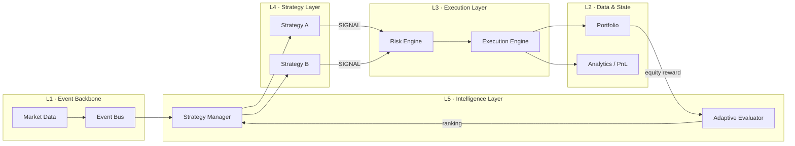

# NeXo — Event-Driven Modular Trading Terminal

[](https://github.com/kriswu5240-collab/nexo/actions/workflows/tests.yml)


NeXo is a modular quantitative-trading terminal: an event-driven Python engine,
a production-ready **FastAPI REST API**, and a **React + TypeScript** web
frontend. The engine coordinates market data, multiple strategies, risk
controls, order execution, portfolio state, backtesting, and adaptive strategy
selection; the API exposes it under a versioned, standardized contract; the
frontend renders it as a full trading terminal.

It is not just a trading bot. It is a testable, layered system-design project in
which each layer has one responsibility and communicates through explicit
contracts — from the internal event bus up to the HTTP API and the UI.

> **v1.0.0** — first unified release of the engine, the `/api/v1` REST API
> (Dashboard, Portfolio, Strategy, Trade History, Backtest, Risk, Settings, and
> Admin modules), and the React terminal frontend. See
> [CHANGELOG.md](CHANGELOG.md).

> **Scope:** NeXo is an educational research simulator. It does not connect to an
> exchange, place real orders, or provide financial advice.

## 30-second overview

- **Three modes:** isolated strategy comparison, combined backtesting, and live simulation
- **Risk before execution:** position and inventory rules gate every order
- **Adaptive routing:** historical PnL seeds strategy scores; live equity changes update rewards
- **Reproducible:** deterministic backtest data and seeded live simulations
- **Verified:** seven unit tests across the event, risk, execution, backtest, and intelligence layers
- **Portable:** Python standard library only; no runtime dependencies

```powershell
py -3 main.py --mode compare
py -3 main.py --mode backtest
py -3 main.py --mode live --duration 10 --seed 42
```

## NeXo Terminal — Web App & REST API

The v1.0.0 product is a two-tier web application over the engine:

- **Backend** — a FastAPI app that preserves the legacy engine and adds a
  versioned `/api/v1` surface with standardized success/error envelopes, request
  validation, global exception handling, structured logging, an in-memory audit
  trail, CORS, OpenAPI docs, and **JWT-ready authentication with User/Admin
  RBAC**. The API only ever *reads and controls the real engine* — it never
  fabricates trading data.
- **Frontend** — a React 18 + TypeScript (Vite) single-page terminal with eight
  modules: Dashboard, Portfolio, Strategy Center, Trade History, Backtest Center,
  Risk Center, Settings, and Admin Console. RM (MYR) is the primary currency with
  an approximate USD conversion.

### Run the backend API

```powershell
py -3 -m pip install -e ".[dashboard]"
py -3 -m uvicorn ui.dashboard:app --reload --port 8002
```

Open **http://127.0.0.1:8002/docs** for interactive OpenAPI documentation. The
default provider is the real runtime engine; set `NEXO_DASHBOARD_PROVIDER=mock`
for a deterministic demo.

### Run the frontend

```bash
cd frontend
pnpm install
pnpm dev            # http://localhost:5173 (proxies /api to the backend)
```

Set `VITE_API_PROXY_TARGET` if the backend runs somewhere other than
`http://127.0.0.1:8002`.

### API surface (`/api/v1`)

| Module | Base path | Highlights |
|---|---|---|
| Health | `/api/v1/health` | Public liveness probe |
| Dashboard | `/api/v1/dashboard` | Summary, equity curve, recent trades |
| Portfolio | `/api/v1/portfolio` | Summary, holdings, allocation, value history, asset details |
| Strategy Center | `/api/v1/strategies` | List, details, comparison, enable/disable* |
| Trade History | `/api/v1/trade-history` | Filtering, pagination, details, CSV export |
| Backtest Center | `/api/v1/backtest` | Run*, status, equity curve, drawdown, metrics, trades, CSV report |
| Risk Center | `/api/v1/risk` | Overview, exposure, config, alerts, emergency stop*, save settings* |
| Settings | `/api/v1/settings` | Profile, theme, language, currency, exchange rate*, notifications, API keys, system info |
| Admin Console | `/api/v1/admin` | Users, KYC, deposits, withdrawals, audit logs, system health, feature flags, maintenance (**admin RBAC**) |

`*` = mutation; requires an authenticated user (or admin) when a JWT secret is
configured via `NEXO_JWT_SECRET`. Capabilities without a backend (e.g. user
records, KYC, notification delivery, API-key issuance) return honest
unavailable/empty states rather than fabricated data.

### Screenshots

Screenshots of the running terminal (Dashboard, Portfolio, Strategy Center,
Risk Center, Settings, and Admin Console) are collected in
[`docs/screenshots/`](docs/screenshots/), which also documents how to regenerate
them from a running dev server.

## Why I built it

Trading examples often combine signal generation, position mutation, and PnL
calculation in one loop. That makes them easy to start but difficult to test,
compare, or extend safely.

NeXo explores a different question:

> How can a small trading simulator preserve the same boundaries used by larger
> event-driven systems?

The project evolved incrementally from an event bus and mock price feed into a
layered research kernel with independent strategy evaluation, pre-trade risk,
shared execution, portfolio analytics, historical replay, and a heuristic
feedback loop.

## Architecture



| Layer | Package | Responsibility |
|---|---|---|
| L1 Event Backbone | `core/` | Event delivery and simulated market data |
| L2 Data & State | `state/` | Portfolio state, trades, valuation, and PnL |
| L3 Execution | `execution/` | Pre-trade risk checks and simulated fills |
| L4 Strategy | `strategies/` | Convert market events into signals only |
| L5 Intelligence | `intelligence/` | Score strategies and route prices to the current winner |
| Historical Research | `backtest/` | Replay deterministic prices independently of live mode |
| Cross-cutting | `observability/` | Console trade logs, risk events, and alerts |

### Event flow

```text
MARKET_PRICE
    → Strategy Manager
    → Selected Strategy
    → SIGNAL
    → Risk Engine
    → Execution Engine
    → Portfolio + Analytics
    → Equity Reward
    → Strategy Evaluator
```

## Demonstration

### 1. Compare strategies fairly

Each candidate receives its own account, the same historical prices, and the
same risk and execution rules:

```powershell
py -3 main.py --mode compare
```

```text
===== ADAPTIVE STRATEGY STATE =====
A | reward=+30.00 | weight=1.0500 | adaptive_score=+31.50 | updates=1
B | reward=+24.00 | weight=1.0500 | adaptive_score=+25.20 | updates=1
Selected Strategy: A
```

### 2. Backtest strategy interaction

Both strategies share one research portfolio, exposing signal interaction and
risk conflicts:

```powershell
py -3 main.py --mode backtest
```

```text
Trades:       11
Total Value:  10038.00
PnL:          +38.00
```

### 3. Run a reproducible live simulation

Live mode evaluates the candidates first, selects the current winner, then feeds
it seeded mock prices. Mark-to-market equity changes become online rewards:

```powershell
py -3 main.py --mode live --duration 10 --seed 42
```

Omit `--duration` to run until `Ctrl+C`. Use `--interval 0.2` to change the
market update interval.

## Design decisions

1. **Events instead of direct orchestration**
   Strategies publish signals without knowing how orders are checked or filled.

2. **Risk before state mutation**
   Execution cannot alter the portfolio until the signal passes the risk engine.

3. **Isolated evaluation**
   Strategy ranking uses separate accounts, preventing one strategy's trades from
   contaminating another strategy's score.

4. **One composition root**
   `main.py` wires dependencies and runtime modes; domain modules remain focused.

5. **Honest intelligence boundary**
   The evaluator is a heuristic reward-weighted selector, not a trained ML or RL
   model. That limitation is explicit and testable.

## Project structure

```text
nexo/
├── backend/           # FastAPI app + engine + APIs
│   ├── api/           #   v1 (simulation view) + v2 (SaaS) REST APIs
│   ├── db/            #   v2 persistence: SQLAlchemy models + session
│   ├── core/ execution/ intelligence/ state/ strategies/ backtest/  # engine
│   ├── ui/            #   FastAPI app, providers, legacy static dashboard
│   ├── observability/ #   console logging and alerts
│   ├── tests/         #   unittest suite (engine + API)
│   └── main.py, pyproject.toml
├── database/          # Alembic migrations (PostgreSQL / SQLite)
├── frontend/          # React + TypeScript (Vite) terminal + v2 API layer
├── docs/              # SDS, product spec, deployment, screenshots
├── Dockerfile         # backend image (Railway)
└── README.md, CHANGELOG.md
```

## Installation and tests

Requirements: Python 3.10+ for the backend; Node.js 18+ and pnpm for the
frontend. Local dev uses a SQLite fallback (no database server required);
production uses PostgreSQL via `DATABASE_URL`.

```bash
git clone https://github.com/kriswu5240-collab/nexo.git
cd nexo

# Backend (engine + v1/v2 APIs)
cd backend
python -m pip install -e ".[dashboard,test]"
python -m unittest discover -s tests -v
NEXO_JWT_SECRET=dev-secret uvicorn ui.dashboard:app --reload --port 8002  # /docs

# Frontend
cd ../frontend
pnpm install
pnpm typecheck && pnpm lint && pnpm test && pnpm build
```

**Deployment** (Railway + Vercel + Postgres) is documented in
[docs/DEPLOYMENT.md](docs/DEPLOYMENT.md). The v2 SaaS layer adds per-user
accounts, a paper wallet with a real ledger, bot subscriptions, a backend bot
worker, and per-user portfolios under `/api/v2` — all **simulated** value, no
real money.

On Windows, `py -3` may be used instead of `python`.

The test suites cover:

- **Engine** — event publish/subscribe, execution and position-limit rejection,
  deterministic backtest results, reward updates and winner-only routing
- **API** — versioned routes and legacy compatibility, standardized envelopes,
  JWT auth and RBAC, per-module derivations (dashboard, portfolio, strategy,
  trade history, backtest, risk, settings, admin), maintenance mode, and OpenAPI
- **Frontend** — routing, pages, services, and component behavior (Vitest)

## Adding a strategy

1. Add a class under `strategies/` that inherits `BaseStrategy`.
2. Implement `on_price()` and emit decisions only through `publish_signal()`.
3. Register it in `build_runtime()` and `seed_evaluator()` in `main.py`.
4. Add a deterministic backtest before enabling it in live simulation.

A strategy must never mutate portfolio state or execute orders directly.

## Current limitations

- in-memory state with no restart recovery
- one symbol and synchronous event processing
- simplified fills with no fees, spread, slippage, or latency
- embedded example prices rather than exchange history
- heuristic adaptive selection rather than trained ML/RL
- no broker, exchange, or real-money integration

These constraints are deliberate. NeXo is a stable research kernel and portfolio
project—not a production trading platform.

## Roadmap

- ingest external historical data behind a data-source interface
- add fees, slippage, and richer risk metrics
- persist runs and produce equity-curve reports
- expose read-only metrics through a dashboard
- add paper-trading adapters before considering broker integration

## Interview pitch

> I built NeXo to demonstrate event-driven system design in a quantitative-trading
> context. Strategies only generate signals; independent risk and execution layers
> decide whether and how portfolio state changes. The same event pipeline supports
> isolated strategy comparison, combined backtesting, and seeded live simulation.
> I also added a transparent reward-weighted selector, deterministic tests, CI, and
> package metadata, while documenting why it is a research simulator rather than a
> production or machine-learning trading platform.
