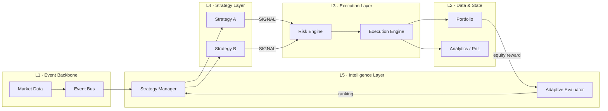

# NeXo — Event-Driven Modular Trading System

[](https://github.com/kriswu5240-collab/nexo/actions/workflows/tests.yml)


NeXo is a modular quantitative-trading simulator built to demonstrate how an
event-driven system coordinates market data, multiple strategies, risk controls,
order execution, portfolio state, backtesting, and adaptive strategy selection.

It is not just a trading bot. It is a small, testable system-design project in
which each layer has one responsibility and communicates through explicit events.

## 30-second overview

- **Three modes:** isolated strategy comparison, combined backtesting, and live simulation
- **Risk before execution:** position and inventory rules gate every order
- **Adaptive routing:** historical PnL seeds strategy scores; live equity changes update rewards
- **Reproducible:** deterministic backtest data and seeded live simulations
- **Verified:** seven unit tests across the event, risk, execution, backtest, and intelligence layers
- **Portable:** Python standard library only; no runtime dependencies

```powershell
py -3 main.py --mode compare
py -3 main.py --mode backtest
py -3 main.py --mode live --duration 10 --seed 42
```

## Dashboard (UI-1)

Install the optional product layer and launch the local dashboard:

```powershell
py -3 -m pip install -e ".[dashboard]"
py -3 -m uvicorn ui.dashboard:app --reload
```

Open `http://127.0.0.1:8000`. The UI-1 dashboard includes a live equity curve,
portfolio allocation, simulated executions, and adaptive strategy state. It uses
a deterministic mock provider; connecting it to the NeXo engine is the UI-2 scope.

> **Scope:** NeXo is an educational research simulator. It does not connect to
> an exchange, place real orders, or provide financial advice.

## Why I built it

Trading examples often combine signal generation, position mutation, and PnL
calculation in one loop. That makes them easy to start but difficult to test,
compare, or extend safely.

NeXo explores a different question:

> How can a small trading simulator preserve the same boundaries used by larger
> event-driven systems?

The project evolved incrementally from an event bus and mock price feed into a
layered research kernel with independent strategy evaluation, pre-trade risk,
shared execution, portfolio analytics, historical replay, and a heuristic
feedback loop.

## Architecture



| Layer | Package | Responsibility |
|---|---|---|
| L1 Event Backbone | `core/` | Event delivery and simulated market data |
| L2 Data & State | `state/` | Portfolio state, trades, valuation, and PnL |
| L3 Execution | `execution/` | Pre-trade risk checks and simulated fills |
| L4 Strategy | `strategies/` | Convert market events into signals only |
| L5 Intelligence | `intelligence/` | Score strategies and route prices to the current winner |
| Historical Research | `backtest/` | Replay deterministic prices independently of live mode |
| Cross-cutting | `observability/` | Console trade logs, risk events, and alerts |

### Event flow

```text
MARKET_PRICE
    → Strategy Manager
    → Selected Strategy
    → SIGNAL
    → Risk Engine
    → Execution Engine
    → Portfolio + Analytics
    → Equity Reward
    → Strategy Evaluator
```

## Demonstration

### 1. Compare strategies fairly

Each candidate receives its own account, the same historical prices, and the
same risk and execution rules:

```powershell
py -3 main.py --mode compare
```

```text
===== ADAPTIVE STRATEGY STATE =====
A | reward=+30.00 | weight=1.0500 | adaptive_score=+31.50 | updates=1
B | reward=+24.00 | weight=1.0500 | adaptive_score=+25.20 | updates=1
Selected Strategy: A
```

### 2. Backtest strategy interaction

Both strategies share one research portfolio, exposing signal interaction and
risk conflicts:

```powershell
py -3 main.py --mode backtest
```

```text
Trades:       11
Total Value:  10038.00
PnL:          +38.00
```

### 3. Run a reproducible live simulation

Live mode evaluates the candidates first, selects the current winner, then feeds
it seeded mock prices. Mark-to-market equity changes become online rewards:

```powershell
py -3 main.py --mode live --duration 10 --seed 42
```

Omit `--duration` to run until `Ctrl+C`. Use `--interval 0.2` to change the
market update interval.

## Design decisions

1. **Events instead of direct orchestration**
   Strategies publish signals without knowing how orders are checked or filled.

2. **Risk before state mutation**
   Execution cannot alter the portfolio until the signal passes the risk engine.

3. **Isolated evaluation**
   Strategy ranking uses separate accounts, preventing one strategy's trades from
   contaminating another strategy's score.

4. **One composition root**
   `main.py` wires dependencies and runtime modes; domain modules remain focused.

5. **Honest intelligence boundary**
   The evaluator is a heuristic reward-weighted selector, not a trained ML or RL
   model. That limitation is explicit and testable.

## Project structure

```text
nexo/
├── backtest/          # Historical replay and deterministic sample data
├── core/              # Event bus and simulated market-data feed
├── execution/         # Execution and pre-trade risk engines
├── intelligence/      # Adaptive evaluator and strategy manager
├── observability/     # Console logging and alerts
├── state/             # Portfolio and performance analytics
├── strategies/        # Strategy interface and implementations
├── tests/              # Standard-library unittest suite
├── main.py             # CLI composition root
└── pyproject.toml      # Package metadata and CLI entry point
```

## Installation and tests

Requirements: Python 3.10 or newer. There are no third-party runtime dependencies.

```bash
git clone https://github.com/kriswu5240-collab/nexo.git
cd nexo
python -m unittest discover -s tests -v
```

On Windows, `py -3` may be used instead of `python`.

The test suite covers:

- event publication and subscription
- successful execution and position-limit rejection
- deterministic Strategy A backtest results
- reward updates and winner-only strategy routing

## Adding a strategy

1. Add a class under `strategies/` that inherits `BaseStrategy`.
2. Implement `on_price()` and emit decisions only through `publish_signal()`.
3. Register it in `build_runtime()` and `seed_evaluator()` in `main.py`.
4. Add a deterministic backtest before enabling it in live simulation.

A strategy must never mutate portfolio state or execute orders directly.

## Current limitations

- in-memory state with no restart recovery
- one symbol and synchronous event processing
- simplified fills with no fees, spread, slippage, or latency
- embedded example prices rather than exchange history
- heuristic adaptive selection rather than trained ML/RL
- no broker, exchange, or real-money integration

These constraints are deliberate. NeXo is a stable research kernel and portfolio
project—not a production trading platform.

## Roadmap

- ingest external historical data behind a data-source interface
- add fees, slippage, and richer risk metrics
- persist runs and produce equity-curve reports
- expose read-only metrics through a dashboard
- add paper-trading adapters before considering broker integration

## Interview pitch

> I built NeXo to demonstrate event-driven system design in a quantitative-trading
> context. Strategies only generate signals; independent risk and execution layers
> decide whether and how portfolio state changes. The same event pipeline supports
> isolated strategy comparison, combined backtesting, and seeded live simulation.
> I also added a transparent reward-weighted selector, deterministic tests, CI, and
> package metadata, while documenting why it is a research simulator rather than a
> production or machine-learning trading platform.
