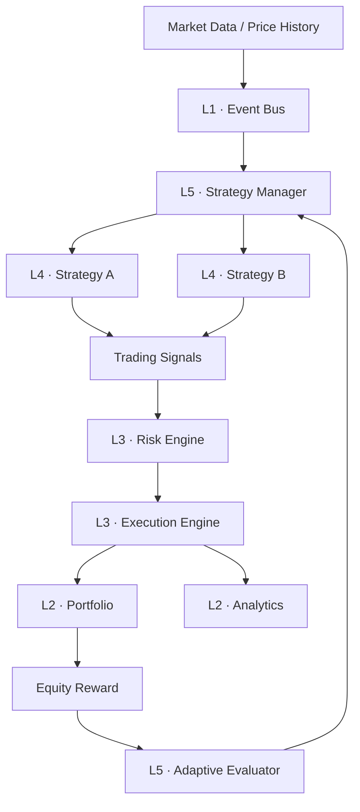

# NeXo — Event-Driven Adaptive Trading Simulator

[](https://github.com/kriswu5240-collab/nexo/actions/workflows/tests.yml)


NeXo is a lightweight Python research project for exploring event-driven trading,
multi-strategy execution, portfolio risk controls, historical replay, and
reward-weighted strategy selection. It uses only the Python standard library.

> NeXo is a simulator and educational research framework. It does not connect to
> an exchange, place real orders, or provide financial advice.

## Architecture



| Layer | Package | Responsibility |
|---|---|---|
| L1 Event Backbone | `core/` | Event delivery and simulated market data |
| L2 Data & State | `state/` | Portfolio state, trades, valuation, and PnL |
| L3 Execution | `execution/` | Pre-trade risk checks and simulated fills |
| L4 Strategy | `strategies/` | Market input → trading signals only |
| L5 Intelligence | `intelligence/` | Strategy scoring, feedback, and selection |
| Historical Research | `backtest/` | Deterministic price replay isolated from live mode |
| Cross-cutting | `observability/` | Console logs and alerts |

## Project structure

```text
nexo/
├── backtest/          # Historical replay and sample data
├── core/              # Event bus and market-data feed
├── execution/         # Execution and risk engines
├── intelligence/      # Evaluator and strategy manager
├── observability/     # Logging and alerts
├── state/             # Portfolio and analytics
├── strategies/        # Base interface and strategy implementations
├── tests/              # Standard-library unittest suite
├── main.py             # CLI composition root
└── pyproject.toml      # Package metadata and CLI entry point
```

## Requirements

- Python 3.10 or newer
- No third-party runtime dependencies

On this Windows machine, use the `py -3` launcher.

## Quick start

```powershell
cd "C:\Users\admin\Documents\Codex\2026-07-05\w\outputs\nexo"
```

Run the deterministic strategy comparison:

```powershell
py -3 main.py --mode compare
```

Run a combined-strategy historical backtest:

```powershell
py -3 main.py --mode backtest
```

Run the adaptive live simulator for 10 seconds:

```powershell
py -3 main.py --mode live --duration 10 --seed 42
```

Omit `--duration` to run until `Ctrl+C`. Use `--interval 0.2` to change the
simulated market update interval.

## Tests

```powershell
py -3 -m unittest discover -s tests -v
```

The suite covers event delivery, execution and risk controls, deterministic
backtest results, and adaptive strategy routing.

## Adding a strategy

1. Create a class in `strategies/` that inherits `BaseStrategy`.
2. Implement `on_price()` and emit decisions through `publish_signal()`.
3. Register the strategy in `build_runtime()` and `seed_evaluator()` in `main.py`.
4. Add a deterministic test before using it in live simulation.

A strategy must not mutate portfolio state or execute an order directly.

## Modes

- `compare`: each strategy receives an isolated account and identical historical
  prices; actual final PnL determines the ranking.
- `backtest`: all registered strategies share one research portfolio to expose
  signal interactions and risk conflicts.
- `live`: candidates are first scored on history; the current winner receives
  simulated market events, and mark-to-market equity changes update its reward.

## Current limitations

- In-memory state only; no database or restart recovery
- Single symbol and synchronous event processing
- Simplified fills with no fees, spread, slippage, or latency
- Small embedded example data set rather than exchange history
- Heuristic reward-weighted selection, not a trained ML/RL model
- No broker or exchange integration; no real-money trading

These constraints are deliberate: NeXo is a stable research kernel that can be
extended without mixing strategy, risk, execution, and state responsibilities.
